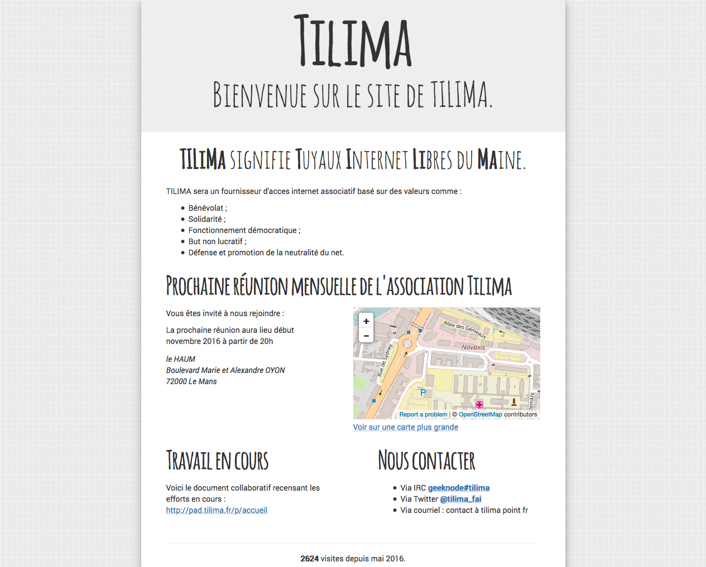

#Site Web de Tilma

Ce dépôt contient tout ce qu'il faut pour générer et modifier cette proposition de maquette pour le site web Tilima.

Ce site utilise les technologies et frameworks suivant  :

*  [bootstap](https://getbootstrap.com/)

*  [sass](http://sass-lang.com/)

*  [compass](http://compass-style.org/)

*  [openstreetmap](https://www.openstreetmap.org/)

### Les polices utilisées proviennent du site :

* [fontsquirrel](https://www.fontsquirrel.com/) :

    * [Amatic Bold et Regular](https://www.fontsquirrel.com/fonts/amatic)

    * [Roboto Regular et Italic ](https://www.fontsquirrel.com/fonts/roboto?q%5Bterm%5D=roboto&q%5Bsearch_check%5D=Y)

### L'image utilisé pour l'arrière plan du site provient [subtlepatterns](http://subtlepatterns.com/) :
* [image](http://subtlepatterns.com/?s=noisy_grid.png)

### Adresse de "dev/présentation" :

http://havresac.net/tilima/

## Capture d'écran du site

 
 

